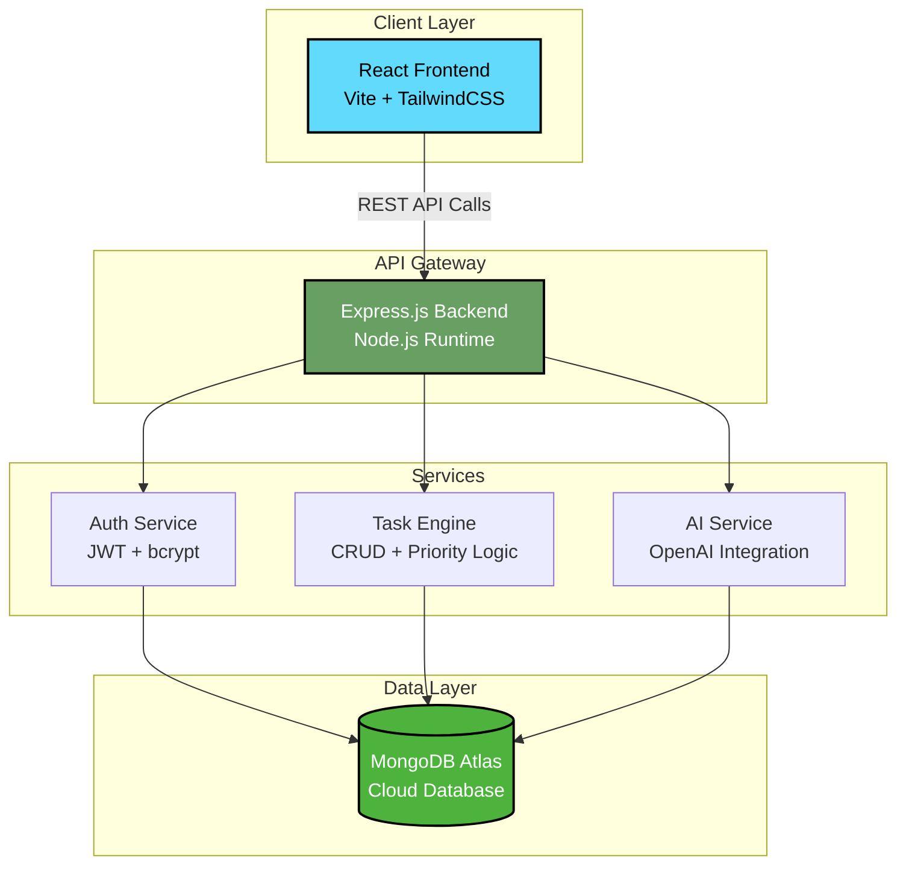

<div align="center">
  


</div>

<div align="center">
  
[](https://git.io/typing-svg)

</div>

<p align="center">
  <a href="https://github.com/VishakhaVB">
    
  </a>
  <a href="https://github.com/VishakhaVB?tab=followers">
    
  </a>
  
  
</p>

<br/>

##  About Me


```javascript
const vishakha = {
    role: "Full-Stack Developer",
    status: "IT Engineering Student",
    location: "India 🇮🇳",
    
    focus: [
        "Building production apps",
        "Backend architecture",
        "System design learning",
        "DSA & problem solving"
    ],
    
    currentlyWorking: "TaskFlow - AI Task Management",
    
    openTo: [
        "Internships",
        "Open Source",
        "Hackathons",
        "Collaborations"
    ],
    
    mindset: "Ship code. Learn fast. Build real things."
};
```

💡 **IT Engineering Student** building real-world full-stack applications with focus on scalable backend systems and clean architecture.

🚀 **Production-focused developer** who believes in shipping deployable projects, not just code repos.

🧠 **Learning through building** — every project teaches system design, API development, and deployment best practices.

<br/>

<br/>

---

## 🚀 Featured Project — TaskFlow

<div align="center">

### 🎯 **Full-Stack AI-Powered Task Management System**

[](https://github.com/VishakhaVB)
[](https://github.com/VishakhaVB)
[](https://github.com/VishakhaVB)
[](https://github.com/VishakhaVB)

</div>

**TaskFlow** is a production-grade full-stack application combining **React**, **Node.js**, **MongoDB**, and **AI** to deliver intelligent task automation with real-world deployment on **Vercel** (frontend) and **Render** (backend).

### 🏗️ System Architecture



### ✨ Key Features

<table>
<tr>
<td width="50%">

**🔐 Authentication System**
- JWT-based secure auth
- Password hashing with bcrypt
- Protected routes & sessions

**📝 Smart Task Management**
- Create, Read, Update, Delete tasks
- Priority-based sorting
- Due date tracking
- Status workflows

</td>
<td width="50%">

**🤖 AI Integration**
- Natural language task creation
- Smart task suggestions
- Automated categorization

**☁️ Production Deployment**
- Frontend: Vercel (CI/CD)
- Backend: Render (24/7 uptime)
- Database: MongoDB Atlas
- Environment-based configs

</td>
</tr>
</table>

### 🛠️ Tech Stack

<p align="center">


</p>

### 🔗 Project Links

<div align="center">

| Resource | Link |
|----------|------|
| 📂 **Frontend Repository** | [github.com/VishakhaVB/taskflow-frontend](https://github.com/VishakhaVB) |
| 📂 **Backend Repository** | [github.com/VishakhaVB/taskflow-backend](https://github.com/VishakhaVB) |
| 🌐 **Live Demo** | [taskflow.vercel.app](https://github.com/VishakhaVB) |
| 🔌 **API Documentation** | [taskflow-api.render.com/docs](https://github.com/VishakhaVB) |

</div>

<br/>

---

## 💼 Other Featured Projects

<table>
<tr>
<td width="50%" valign="top">

### 🛒 E-Commerce Platform

**Production-focused online store with payment integration**

**Tech Stack:**
<br/>


**Features:**
- User authentication & authorization
- Product catalog with search/filter
- Shopping cart & checkout flow
- Payment gateway integration
- Admin dashboard

📂 **Repository:** [github.com/VishakhaVB/ecommerce-app](https://github.com/VishakhaVB)
<br/>
🌐 **Live Demo:** [Coming Soon]

</td>

<td width="50%" valign="top">

### 📊 Analytics Dashboard

**Real-time data visualization platform**

**Tech Stack:**
<br/>


**Features:**
- Interactive data visualizations
- Real-time data processing
- Custom chart components
- Export functionality
- Responsive design

📂 **Repository:** [github.com/VishakhaVB/analytics-dashboard](https://github.com/VishakhaVB)
<br/>
🌐 **Live Demo:** [Coming Soon]

</td>
</tr>

<tr>
<td width="50%" valign="top">

### 💬 Real-Time Chat Application

**WebSocket-based messaging platform**

**Tech Stack:**
<br/>


**Features:**
- Real-time messaging
- Multiple chat rooms
- User presence indicators
- Message history
- Emoji support

📂 **Repository:** [github.com/VishakhaVB/chat-app](https://github.com/VishakhaVB)

</td>

<td width="50%" valign="top">

### 🎨 Portfolio Website

**Personal developer showcase**

**Tech Stack:**
<br/>


**Features:**
- Responsive design
- Project showcase
- Contact form
- Blog section
- Smooth animations

📂 **Repository:** [github.com/VishakhaVB/portfolio](https://github.com/VishakhaVB)
<br/>
🌐 **Live Demo:** [Coming Soon]

</td>
</tr>
</table>

<br/>

---

## 💻 Tech Stack

<table align="center">
<tr>
<td align="center" width="25%">

### Languages


</td>
<td align="center" width="25%">

### Frontend


</td>
<td align="center" width="25%">

### Backend


</td>
<td align="center" width="25%">

### Tools & Platforms


</td>
</tr>
</table>

<br/>

---

## 🏗️ System Design & Engineering Focus

<div align="center">

### 🎯 Learning Path

**Backend Architecture** → **API Design** → **Database Optimization** → **Cloud Deployment**

</div>

<table align="center">
<tr>
<td width="33%" align="center">

**🔧 Backend Development**
<br/>
RESTful API design
<br/>
Authentication & Authorization
<br/>
Database modeling

</td>
<td width="33%" align="center">

**📊 System Design**
<br/>
Scalable architecture patterns
<br/>
Caching strategies
<br/>
Load balancing concepts

</td>
<td width="33%" align="center">

**☁️ DevOps & Deployment**
<br/>
CI/CD pipelines
<br/>
Cloud platforms (Vercel, Render)
<br/>
Environment management

</td>
</tr>
</table>

<br/>

---

## 🌐 Live Systems Built

<div align="center">

| Project | Status | Tech | Hosting |
|---------|--------|------|---------|
| **TaskFlow** | 🟢 Live | React + Node.js + MongoDB | Vercel + Render |
| **Portfolio Site** | 🟡 Development | React + TailwindCSS | Vercel |
| **Chat App** | 🟡 Testing | Socket.io + Express | Render |
| **API Gateway** | 🟢 Live | Node.js + Express | Render |

</div>

<br/>

---

## 📡 Backend API Showcase

<div align="center">

### TaskFlow REST API Endpoints

</div>

```javascript
// Authentication
POST   /api/auth/register          // User registration
POST   /api/auth/login             // User login
GET    /api/auth/profile           // Get user profile

// Task Management
GET    /api/tasks                  // Get all tasks
POST   /api/tasks                  // Create new task  
GET    /api/tasks/:id              // Get single task
PUT    /api/tasks/:id              // Update task
DELETE /api/tasks/:id              // Delete task

// AI Features
POST   /api/ai/generate-task       // AI task generation
POST   /api/ai/suggest             // Smart suggestions
```

**🔐 Security Features:**
- JWT authentication middleware
- Request rate limiting
- Input validation & sanitization
- CORS configuration
- Environment-based secrets

**📈 Performance:**
- Response caching
- Database indexing
- Optimized queries
- Error handling

<br/>

---

## 📊 GitHub Statistics

<div align="center">
  


<br/><br/>


<br/><br/>


</div>

<br/>

---

## 🔭 What I'm Building Now

<table>
<tr>
<td width="50%">

### 🎯 Current Sprint

**📌 TaskFlow v2.0 Enhancements**
- [ ] Team collaboration features
- [ ] Real-time updates with WebSocket
- [ ] Advanced analytics dashboard
- [ ] Mobile responsive improvements

**📌 Learning Focus**
- GraphQL API development
- Docker containerization
- AWS deployment basics
- System design patterns

</td>
<td width="50%">

### 🚀 Upcoming Projects

**💡 DevConnect** - Developer networking platform
<br/>
Tech: Next.js, TypeScript, Prisma, PostgreSQL

**💡 CodeSnippet Hub** - Code snippet manager
<br/>
Tech: React, Node.js, MongoDB

**💡 Learning Tracker** - Progress tracking app
<br/>
Tech: MERN Stack + AI

**📚 Skill Development**
- Kubernetes basics
- Microservices architecture
- Advanced React patterns

</td>
</tr>
</table>

<br/>

---

## 🏆 Achievements & Recognition

<div align="center">

<table>
<tr>
<td width="50%" align="center">

### 🎓 Certifications


</td>
<td width="50%" align="center">

### 🥇 Competitions & Events


</td>
</tr>
</table>

<br/>


</div>

<br/>

---

## 🐍 Contribution Activity

<div align="center">
  
<picture>
  <source media="(prefers-color-scheme: dark)" srcset="https://raw.githubusercontent.com/VishakhaVB/VishakhaVB/output/github-contribution-grid-snake-dark.svg">
  <source media="(prefers-color-scheme: light)" srcset="https://raw.githubusercontent.com/VishakhaVB/VishakhaVB/output/github-contribution-grid-snake.svg">
  
</picture>

</div>

<br/>

---

## 🤝 Let's Connect

<div align="center">

<a href="https://www.linkedin.com/in/vishakha-bhilwadkar-987722285/">
  
</a>
<a href="mailto:vishakhabhilwadkar@gmail.com">
  
</a>
<a href="https://wa.me/917709226241">
  
</a>
<a href="https://github.com/VishakhaVB">
  
</a>
<a href="#">
  
</a>

<br/><br/>

### 💼 Open for Opportunities

**Internships** • **Freelance Projects** • **Open Source Collaboration** • **Tech Consultations**

<br/>


</div>

<br/>

---

<div align="center">

### 💡 **"Code. Build. Deploy. Repeat."**

<br/>


<br/><br/>

**⚡ Fun Fact:** I believe the best debugging tool is `console.log()` + coffee ☕

</div>

<br/>

---

<div align="center">


**⭐ From [VishakhaVB](https://github.com/VishakhaVB) — Building Real Systems, One Commit at a Time**

</div>
